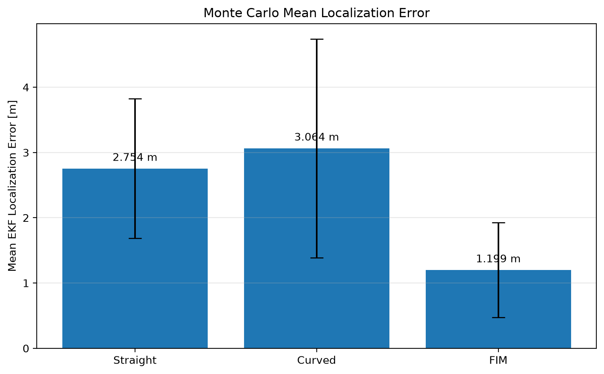
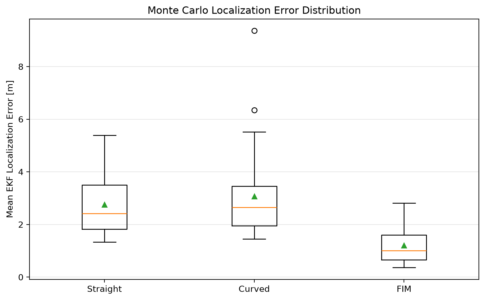
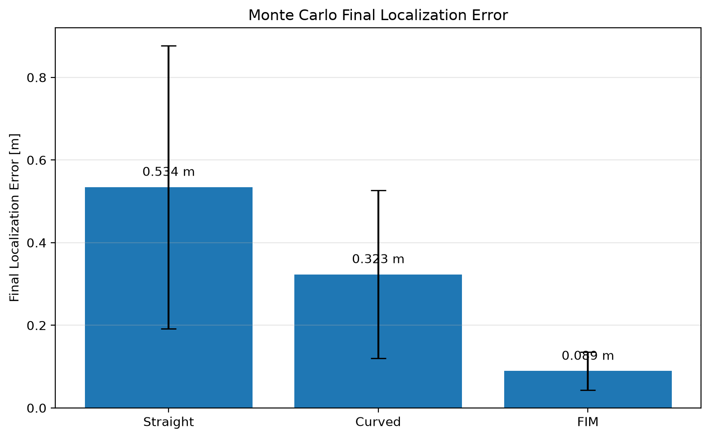

# AOA-Based UAV Emitter Localization with EKF and FIM Path Planning

## Overview

This project implements a passive emitter localization system using Angle of Arrival (AOA) measurements collected by a moving UAV.

The project began by reconstructing an undergraduate AOA-based emitter localization study in Python and was progressively extended to investigate the relationship between estimator design, measurement geometry, and UAV trajectory planning.

The development process included:

- AOA-based emitter localization
- Least Squares (LS) position estimation
- Linear Kalman Filter (KF)
- Extended Kalman Filter (EKF) using direct AOA measurements
- Fisher Information Matrix (FIM)-based adaptive trajectory planning
- Cramer-Rao Lower Bound (CRLB) analysis
- Equal-measurement-budget trajectory comparison
- 30-run quantitative evaluation under random AOA measurement noise

The main objective is to investigate how both the localization estimator and the UAV observation trajectory affect passive emitter localization accuracy.

---

## Problem Definition

The UAV attempts to estimate the position of a stationary emitter using noisy AOA measurements.

The true emitter position used in the experiments is:

    (30.0, 30.0) m

The AOA measurement is modeled as:

    theta = atan2(y_e - y_u, x_e - x_u)

where:

- `(x_u, y_u)` is the UAV position
- `(x_e, y_e)` is the emitter position
- `theta` is the measured bearing angle

Gaussian angular noise is added to simulate measurement uncertainty.

The primary experiments use:

    AOA noise standard deviation = 2.0 deg

Because the AOA measurement model is nonlinear with respect to emitter position, the project eventually uses an Extended Kalman Filter to directly process the angular measurements.

---

## Development Flow

The project was developed incrementally.

    AOA Measurements
          |
          v
    Least Squares
          |
          v
    Linear Kalman Filter
          |
          v
    Extended Kalman Filter
          |
          v
    Trajectory Geometry Analysis
          |
          v
    Fisher Information Matrix
          |
          v
    Adaptive UAV Path Planning
          |
          v
    CRLB Evaluation
          |
          v
    Repeated Quantitative Evaluation

Each stage was introduced after identifying limitations in the previous approach.

---

## 1. AOA Localization

AOA measurements from multiple UAV positions define bearing directions toward the emitter.

Ideally, measurements collected from sufficiently different observation positions provide intersecting bearing information that can be used to estimate the emitter location.

A Least Squares estimator was initially used to obtain a 2D emitter position from multiple AOA measurements.

This established the basic localization pipeline.

---

## 2. Linear Kalman Filter

A linear Kalman Filter was initially applied to position estimates produced by the Least Squares estimator.

The original pipeline was:

    AOA Measurements
          |
          v
    Least Squares
          |
          v
    Position Estimate
          |
          v
    Linear Kalman Filter

Experiments showed that applying the linear KF did not necessarily improve localization accuracy.

One important reason was that successive Least Squares estimates reused many of the same AOA measurements and therefore were not fully independent position observations.

This motivated the transition to a measurement model that directly processes AOA.

---

## 3. Extended Kalman Filter

The Extended Kalman Filter directly uses the nonlinear AOA measurement model.

The EKF measurement function is based on:

    h(x, y) = atan2(y - y_u, x - x_u)

The corresponding Jacobian is evaluated around the current emitter estimate during each measurement update.

The resulting pipeline becomes:

    UAV Position
         |
         +------+
                |
                v
         AOA Measurement
                |
                v
              EKF
                |
                v
         Emitter Estimate

This avoids converting every AOA measurement into an intermediate LS position measurement before filtering.

In the earlier simulation experiments, the EKF significantly improved localization performance compared with the linear KF.

Example result:

    Linear KF mean error: 8.236 m
    EKF mean error:       2.502 m

Final EKF estimate:

    (29.8700, 30.2655)

True emitter position:

    (30.0, 30.0)

---

## 4. Importance of Measurement Geometry

The experiments showed that localization accuracy depends not only on the estimator but also on the geometry of the UAV observations.

If the UAV collects AOA measurements from geometrically similar positions, the bearing measurements may provide limited additional information.

Changing the trajectory changes the diversity of observation angles and therefore changes the localization performance.

This observation motivated the transition from predefined trajectories to active trajectory planning.

The key question became:

> Where should the UAV collect the next AOA measurement to obtain the most useful localization information?

---

## 5. Fisher Information Matrix Path Planning

A Fisher Information Matrix-based planner was implemented to evaluate candidate UAV observation positions.

At each planning step, candidate waypoints are generated around the current UAV position.

The standalone simulation initially evaluates 8 candidate directions and selects the waypoint with the highest FIM-based information score.

The planning process is:

    Current UAV Position
            |
            v
    Current EKF Estimate
            |
            v
    Generate Candidate Waypoints
            |
            v
    Evaluate Fisher Information
            |
            v
    Select Best Candidate
            |
            v
    Move to New Observation Position
            |
            v
    Collect AOA Measurement
            |
            v
    Update EKF
            |
            +--------------------+
                                 |
                                 v
                           Repeat Planning

The planner therefore adapts the UAV trajectory according to the current localization estimate rather than following only a predefined path.

The later ROS2 closed-loop implementation increases the directional resolution to 16 candidate directions.

---

## 6. FIM Adaptive Trajectory Result

A FIM-based adaptive path was compared with a predefined curved trajectory.

An earlier individual simulation run produced:

    Curved-path EKF mean error: 2.502 m
    FIM-path EKF mean error:    1.404 m

The final FIM-path EKF estimate was:

    (30.0028, 29.9643)

with a final localization error of approximately:

    0.036 m

This experiment showed that actively selecting measurement positions could improve localization performance.

Because these values came from an individual simulation run, repeated statistical evaluation was subsequently performed.

---

## 7. CRLB Analysis

The Cramer-Rao Lower Bound was used to evaluate the theoretical localization quality associated with different measurement geometries.

Initial comparison:

    Curved-path CRLB position bound: 0.1225 m
    FIM-path CRLB position bound:    0.0553 m

Improvement:

    54.81%

However, the number of measurements can also influence the CRLB.

To isolate the effect of trajectory geometry, an additional comparison was performed using the same measurement budget.

---

## 8. Equal Measurement Budget Comparison

Both trajectories were evaluated using:

    Measurement budget = 25

The curved trajectory was downsampled so that the number of observations matched the FIM trajectory.

The resulting CRLB values were:

    Curved-path CRLB: 0.3379 m
    FIM-path CRLB:    0.0553 m

CRLB reduction:

    83.62%

This experiment provided additional evidence that the improvement was related to observation geometry rather than simply collecting more measurements.

---

## 9. Quantitative Evaluation

To determine whether the FIM performance improvement remained consistent under different random AOA noise realizations, a 30-run repeated evaluation was performed.

### Experimental Conditions

    Number of runs: 30
    Measurement budget: 25
    AOA noise standard deviation: 2.0 deg
    True emitter position: (30.0, 30.0)

Three trajectory strategies were compared:

- Straight trajectory
- Predefined curved trajectory
- FIM-based adaptive trajectory

For each run, the same random seed was used across the three trajectory strategies to provide comparable noise conditions.

---

## Quantitative Results

| Trajectory | Mean EKF Error | Std. Dev. | Mean Final Error | Final Error Std. |
|---|---:|---:|---:|---:|
| Straight | 2.7536 m | 1.0683 m | 0.5344 m | 0.3423 m |
| Curved | 3.0638 m | 1.6750 m | 0.3231 m | 0.2032 m |
| **FIM Adaptive** | **1.1988 m** | **0.7270 m** | **0.0892 m** | **0.0462 m** |

The FIM-based adaptive trajectory reduced the mean EKF localization error by:

    56.46% compared with Straight
    60.87% compared with Curved

The FIM trajectory also achieved an average final localization error of:

    0.0892 m

The lower standard deviation indicates that the FIM-based trajectory produced more consistent localization performance across the evaluated noise realizations.

---

## Mean Localization Error

The FIM-based adaptive trajectory achieved the lowest average EKF localization error across the 30 runs.

---

## Localization Error Distribution

The box plot shows the distribution of mean EKF localization errors across the repeated experiments.

The FIM-based trajectory produced both a lower median error and a narrower error distribution.

This indicates that the improvement was not limited to a single favorable random noise realization.

---

## Final Localization Error

The FIM-based trajectory also achieved the lowest average final localization error.

    Straight: 0.5344 m
    Curved:   0.3231 m
    FIM:      0.0892 m

---

## Interpretation

The quantitative evaluation produced an important observation.

Under the equal 25-measurement budget, the predefined curved trajectory did not achieve a lower mean EKF error than the straight trajectory.

This indicates that curvature alone does not guarantee better localization.

What matters is whether the selected observation positions provide useful geometric information about the emitter.

The FIM planner explicitly evaluates the expected information associated with candidate observation positions and adapts the trajectory according to the current emitter estimate.

The repeated evaluation therefore supports the conclusion that information-driven trajectory planning is more effective than relying only on a predefined trajectory shape.

---

## Project Structure

    ros2_kf/
    |
    +-- filter/
    |   +-- ekf.py
    |   +-- kf.py
    |
    +-- loc/
    |   +-- aoa_loc.py
    |
    +-- plan/
    |   +-- fim.py
    |   +-- planner.py
    |
    +-- sim/
    |   +-- aoa.py
    |   +-- path.py
    |
    +-- results/
    |   +-- experiment_log.md
    |   +-- path_evaluation.csv
    |   +-- plots/
    |       +-- mean_error_comparison.png
    |       +-- mean_error_distribution.png
    |       +-- final_error_comparison.png
    |
    +-- evaluate_paths.py
    +-- plot_path_evaluation.py
    +-- main.py
    +-- requirements.txt
    +-- README.md

---

## Main Modules

### `sim/aoa.py`

Generates AOA measurements between the UAV and the emitter and adds measurement noise.

### `sim/path.py`

Generates predefined UAV trajectories used in localization experiments.

### `loc/aoa_loc.py`

Implements AOA-based Least Squares emitter localization.

### `filter/kf.py`

Implements the linear Kalman Filter used in the early localization experiments.

### `filter/ekf.py`

Implements the Extended Kalman Filter that directly processes nonlinear AOA measurements.

### `plan/fim.py`

Implements Fisher Information Matrix calculations for evaluating measurement geometry.

### `plan/planner.py`

Generates candidate UAV waypoints and selects observation positions using the FIM-based information score.

### `evaluate_paths.py`

Performs the 30-run quantitative comparison between Straight, Curved, and FIM-based trajectories.

### `plot_path_evaluation.py`

Generates visualization figures from the quantitative evaluation results.

---

## Running the Simulation

Create and activate a Python virtual environment, then install the required dependencies.

On Windows PowerShell:

    python -m venv env
    .\env\Scripts\Activate.ps1
    pip install -r requirements.txt

Run the main localization experiments:

    python main.py

Run the 30-run quantitative evaluation:

    python evaluate_paths.py

Generate the evaluation figures:

    python plot_path_evaluation.py

The quantitative results are saved to:

    results/path_evaluation.csv

The generated figures are saved to:

    results/plots/

---

## Experiment Log

The detailed development and experiment history is recorded in:

    results/experiment_log.md

The experiment log documents the progression from the initial AOA localization implementation through KF, EKF, FIM trajectory planning, CRLB analysis, and repeated quantitative evaluation.

---

## ROS2 Extension

The algorithms developed in this repository were subsequently extended into a ROS2-based distributed localization system.

The ROS2 implementation separates the localization pipeline into independent nodes for:

- UAV position publishing and waypoint following
- AOA measurement generation
- EKF emitter localization
- FIM waypoint planning

In the ROS2 implementation, the AOA node combines the UAV observation coordinates with the corresponding noisy AOA measurement before publishing the measurement data to the EKF.

The resulting feedback structure is:

    UAV Position
         |
         v
    AOA Measurement
         |
         v
    EKF Localization
         |
         v
    FIM Planner
         |
         v
    Next Waypoint
         |
         +----------> UAV Movement

The ROS2 implementation is maintained separately from this simulation and algorithm-development repository.

---

## Key Findings

1. AOA emitter localization is strongly affected by measurement geometry.

2. Applying a linear Kalman Filter to repeated LS position estimates does not necessarily improve localization accuracy.

3. Directly processing nonlinear AOA measurements with an EKF substantially improves emitter localization.

4. A predefined curved trajectory does not automatically guarantee better localization under a fixed measurement budget.

5. Fisher Information Matrix-based planning can actively select more informative observation positions.

6. Under a 25-measurement budget and 30 repeated runs, the FIM-based trajectory achieved a mean EKF error of 1.1988 m.

7. The FIM trajectory reduced mean localization error by 56.46% compared with the Straight trajectory and 60.87% compared with the predefined Curved trajectory.

8. CRLB analysis independently demonstrated improved theoretical localization geometry for the FIM-selected trajectory.

---

## Conclusion

This project demonstrates the progression from basic AOA-based passive emitter localization to an information-driven active localization system.

The experiments showed that improving the estimator alone is not sufficient. The geometry of the measurements collected by the moving UAV also has a significant influence on localization performance.

By combining direct AOA-based EKF estimation with Fisher Information Matrix-based trajectory planning, the UAV can adaptively select observation positions that provide more useful localization information.

Repeated quantitative evaluation and CRLB analysis both support the effectiveness of the information-driven trajectory planning approach.